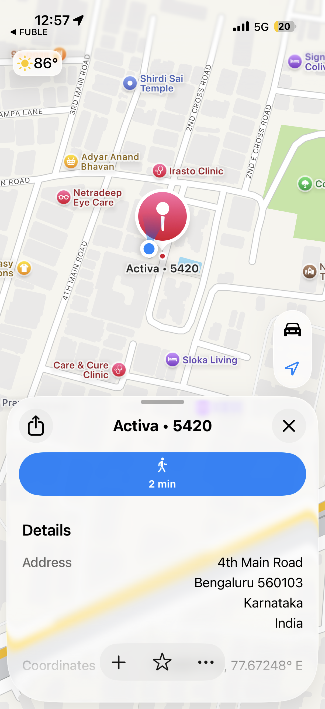

# FUBLE — Find My Scooter

An iOS app that uses **Bluetooth Low Energy (BLE)** to help you locate your vehicle. When your phone disconnects from the scooter's ESP32 device, it automatically saves your GPS location so you can navigate back to it.

---

## Features

- **BLE proximity radar** — visual halo + dot moves closer as RSSI improves
- **Auto-saves parked location** — GPS coordinates stored the moment your scooter disconnects
- **"Parked" button** — one tap opens Apple Maps to navigate back
- **Device info sheet** — shows device ID and live signal strength
- **Auto-reconnect** — app resumes scanning after Bluetooth restarts or disconnect

---

## Screenshots

<p float="left">
  
  
  
  
  
</p>

---

## Requirements

| Requirement | Version / Details |
|---|---|
| iOS | 16.0+ |
| Xcode | 15.0+ |
| Swift | 5.9+ |
| iPhone | Bluetooth 4.0+ (BLE capable) |
| BLE Device | ESP32 (recommended), or any BLE GATT server that can advertise the service UUID and send JSON over a notify characteristic — e.g. ESP32-S3, nRF52840, Arduino Nano 33 BLE |

---

## Hardware Setup (ESP32)

The app connects to an **ESP32** running a BLE GATT server. The ready-to-flash firmware is included at [`ESP32_Firmware/fuble_ble.ino`](ESP32_Firmware/fuble_ble.ino).

### Prerequisites

| Tool | Where to get |
|---|---|
| Arduino IDE 2.x | [arduino.cc/en/software](https://www.arduino.cc/en/software) |
| ESP32 board package | Add this URL in Arduino → Preferences → Additional Board URLs: `https://raw.githubusercontent.com/espressif/arduino-esp32/gh-pages/package_esp32_index.json` then install **esp32 by Espressif** via Boards Manager |
| ArduinoJson library v6+ | Arduino IDE → Library Manager → search **ArduinoJson** by Benoit Blanchon |

### Step 1 — Configure the firmware

Open `ESP32_Firmware/fuble_ble.ino` and edit the two lines at the top of the file:

```cpp
// Replace with your vehicle name — must match kDeviceName in BLEManager.swift
#define DEVICE_NAME "Your Vehicle Name"

// A unique ID for your ESP32 — shown in the app's Device Info sheet
#define DEVICE_ID   "YOUR-DEVICE-ID"
```

### Step 2 — Flash to ESP32

1. Connect your ESP32 via USB
2. In Arduino IDE select **Tools → Board → ESP32 Dev Module**
3. Select the correct **Port** under Tools
4. Click **Upload** (⌘U / Ctrl+U)
5. Open **Serial Monitor** at `115200` baud — you should see:

```
[FUBLE] Starting up...
[BLE] Advertising as: Your Vehicle Name
```

### Step 3 — Verify connection

Once the firmware is running, open the iOS app on your iPhone. It will automatically scan for and connect to your ESP32. The proximity radar will activate as soon as a connection is established.

### BLE identifiers

The firmware and iOS app share these UUIDs — **do not change one without changing the other**:

| Identifier | Value |
|---|---|
| Service UUID | `4fafc201-1fb5-459e-8fcc-c5c9c331914b` |
| Characteristic UUID | `beb5483e-36e1-4688-b7f5-ea07361b26a8` |

The characteristic sends JSON in this format, which the iOS app decodes:

```json
{
  "deviceId": "YOUR-DEVICE-ID",
  "location": "scooter"
}
```

### Performance tuning

Two constants in the firmware control discovery speed and battery use:

```cpp
#define ADV_INTERVAL_MS    100   // Advertising interval — lower = faster iPhone discovery
#define NOTIFY_INTERVAL_MS 500   // How often ESP32 pushes RSSI notify to iPhone
```

Increase `ADV_INTERVAL_MS` (e.g. to `500`) to reduce ESP32 power consumption at the cost of slightly slower initial discovery.

---

## Getting Started

### 1. Clone the repo

```bash
git clone https://github.com/<your-username>/FindMY.git
cd FindMY
```

### 2. Open in Xcode

```bash
open FindMy.xcodeproj
```

Or double-click `FindMy.xcodeproj` in Finder.

### 3. Configure signing

1. Select the `FindMY` target in Xcode
2. Go to **Signing & Capabilities**
3. Set your **Team** (Apple Developer account)
4. Change the **Bundle Identifier** to something unique, e.g. `com.yourname.fuble`

### 4. Add required permissions to `Info.plist`

The following keys must be present (Xcode may auto-add them — verify they exist):

| Key | Purpose |
|---|---|
| `NSBluetoothAlwaysUsageDescription` | Scanning for the ESP32 device |
| `NSLocationWhenInUseUsageDescription` | Saving parked location on disconnect |

Example values:
```xml
<key>NSBluetoothAlwaysUsageDescription</key>
<string>FUBLE uses Bluetooth to find your scooter.</string>
<key>NSLocationWhenInUseUsageDescription</key>
<string>FUBLE saves your location when your scooter disconnects so you can find it later.</string>
```

### 5. Build and run

- Connect your iPhone via USB (BLE and GPS require a real device — simulator won't work)
- Select your device in the Xcode toolbar
- Press **⌘R** to build and run

---

## Customising Your Device Name

There is one place to change on each side:

| File | What to change |
|---|---|
| `ESP32_Firmware/fuble_ble.ino` | `#define DEVICE_NAME` and `#define DEVICE_ID` |
| `FindMY/BLEManager.swift` | `let kDeviceName` (line 8) |

Both values must match for the iOS app to find and connect to your ESP32.

---

## Project Structure

```
FindMY/
├── ESP32_Firmware/
│   └── fuble_ble.ino          # ESP32 BLE firmware (flash this to your device)
├── FindMY/
│   ├── FUBLE.swift            # App entry point
│   ├── ContentView.swift      # Main UI + parking logic
│   ├── BLEManager.swift       # CoreBluetooth scanning & connection (set kDeviceName here)
│   ├── LocationManager.swift  # CoreLocation GPS tracking
│   ├── ProximityModel.swift   # RSSI → proximity level mapping
│   └── Assets.xcassets/       # App icon, scooter images
├── FindMyTests/
└── FindMyUITests/
```

---

## Security Notes

- No API keys, passwords, or tokens are stored in this codebase.
- The BLE UUIDs are device-pairing identifiers, not secrets — they must match your ESP32 firmware.
- Parked location is stored in iOS `UserDefaults` (via `@AppStorage`) — it never leaves your device.
- `xcuserdata/` (personal Xcode settings) is excluded via `.gitignore`.

---

## License

MIT — free to use and modify.
